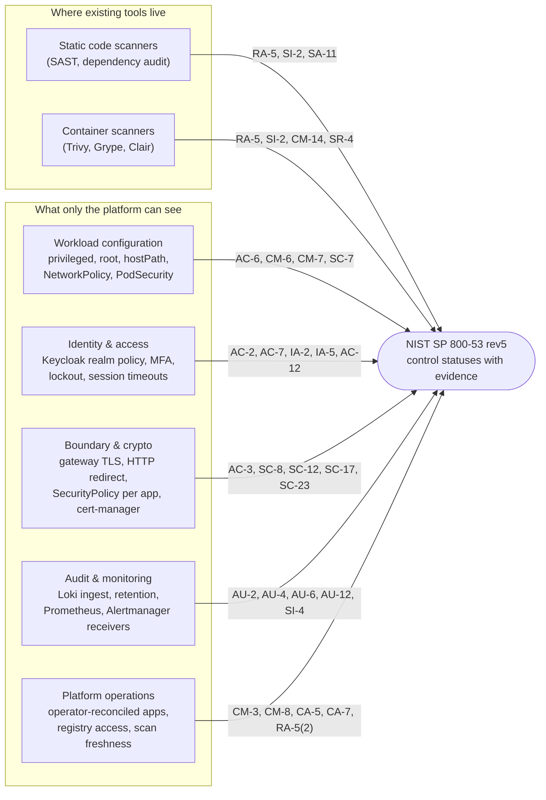
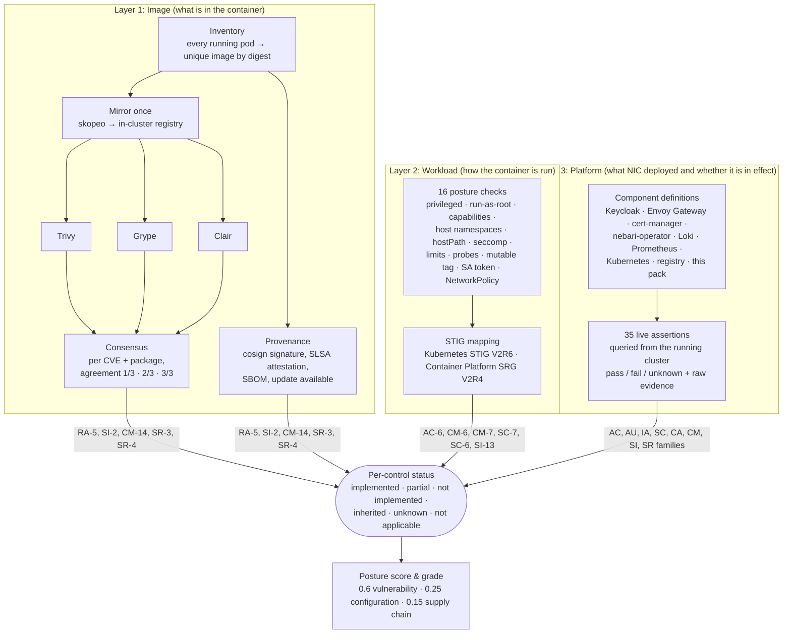
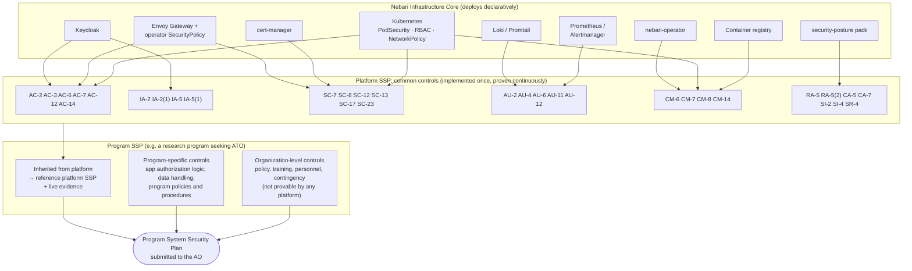
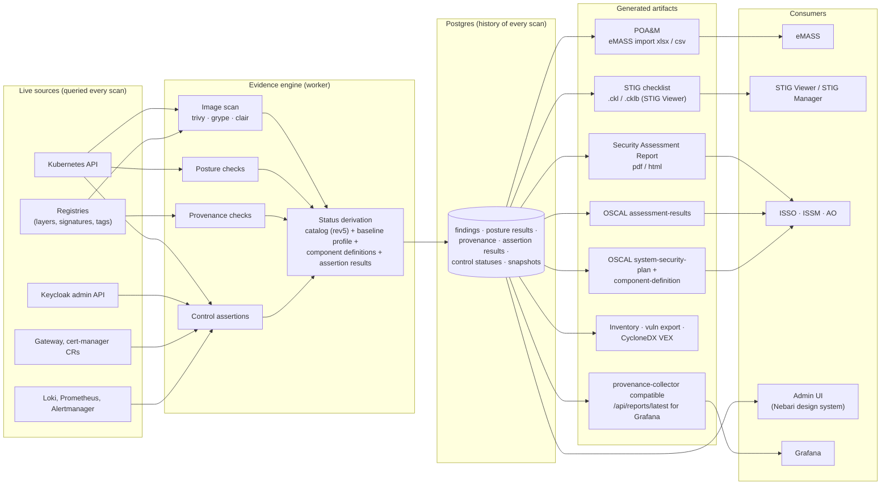
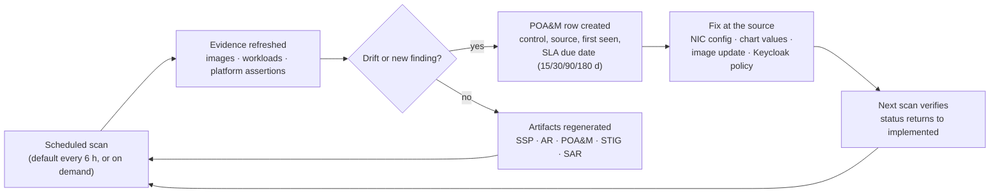

# Architecture: from container scans to an 800-53 control picture

This page is the 30,000-foot view of how the pack turns what Nebari deploys into
continuous ATO evidence. It is written for people deciding whether to adopt the
model, not for people operating it. Operating docs: [CONTROLS.md](CONTROLS.md),
[REPORTS.md](REPORTS.md), [PROVENANCE.md](PROVENANCE.md), [SCORING.md](SCORING.md).

## 1. The core idea: ownership beats scanning

A vulnerability scanner looks at an artifact and can only report defects. It can
say "RA-5: here are CVEs". It can never say "AC-2 is satisfied", because it does
not own identity.

Nebari Infrastructure Core (NIC) deploys the whole platform declaratively:
Keycloak, Envoy Gateway, cert-manager, logging, the nebari-operator, and every
software pack. So for a large set of controls the platform knows two things no
scanner can:

1. **What the intended implementation is**, because NIC wrote it.
2. **Whether it is actually in effect right now**, because the pack can query it.

Put those together and the platform becomes what SP 800-53 calls a **common
control provider**. The platform implements a control once, continuously proves
it, and every program running on Nebari inherits it.

## 2. Three evidence layers, one control picture

The pack collects evidence at three altitudes. Each layer answers different
control families; together they cover most of the technical controls in the
MODERATE baseline.

## 3. Control inheritance: the platform as common control provider

This is the part that changes the economics of an ATO. A program's SSP must
answer every control. Most of the technical answers describe the platform the
program runs on. With this model the program inherits those from a platform
SSP that is machine-generated and refreshed on every scan, and writes only the
controls that are genuinely its own.

Honest boundaries of the model:

- **Organizational controls** (roughly two thirds of the catalog) are policies,
  training, personnel and contingency planning. The engine reports them as
  *inherited from the organization*. That is a claim the ISSO must stand behind,
  not evidence. `controlsEngine.inheritOrganizationalControls=false` reports
  them as *not implemented* instead.
- **Some technical controls are invisible from inside the cluster.** API-server
  audit logging on MicroK8s returns *unknown* for exactly that reason. More is
  visible on NIC-provisioned cloud clusters, but never everything.
- **Organization-defined parameters** (lockout threshold, idle timeout, password
  length, log retention) default to FedRAMP Moderate values and are settings,
  because an IL4 program may tailor differently.
- **Assessors accept evidence, not tools.** Every assertion carries its raw
  evidence and timestamp so a human doing a sample-based check can verify it.

## 4. The evidence pipeline: from live cluster to eMASS

## 5. The continuous-ATO loop

Once the evidence is live, the ATO stops being a document and becomes a loop.
Every scan re-derives control status; anything that regresses shows up as drift
with an SLA clock, and most platform-level fixes are one-line NIC configuration
changes that the next scan verifies.

## 6. What this looked like on the first run

The `grace` lab cluster, MODERATE baseline, 2026-10-03 (details in
[CONTROLS.md](CONTROLS.md)): 35 assertions, 19 pass, 15 fail, 1 unknown. The
platform reported on itself: no Keycloak password policy, no MFA on the admin
account, login and admin events not recorded, 21 of 23 namespaces without a
PodSecurity enforce label, no default-deny NetworkPolicy in any app namespace,
anonymous access to the in-cluster registry. Nobody wrote those findings down.

Most of them are one-line changes in NIC. That points at the next step: ship a
hardened baseline in the operator so a fresh Nebari deployment starts mostly
green, and this pack becomes the drift detector rather than the bearer of bad
news.

## Where the pieces live

| Concern | Code | Doc |
|---|---|---|
| Inventory, mirroring, scanners, consensus, scoring | `api/src/posture/{inventory,mirror,scanners,correlate,scoring}.py` | [SCORING.md](SCORING.md) |
| Posture checks and STIG mapping | `api/src/posture/posture_checks.py`, `reports/data/stig_mapping.yaml` | [REPORTS.md](REPORTS.md) |
| Provenance (signatures, SLSA, SBOM, updates, Helm) | `api/src/posture/provenance/` | [PROVENANCE.md](PROVENANCE.md) |
| Catalog, component definitions, assertions, SSP | `api/src/posture/controls_engine/` | [CONTROLS.md](CONTROLS.md) |
| NIST control tagging | `api/src/posture/reports/data/controls.yaml` | [DESIGN.md §11](DESIGN.md) |
| Report generators | `api/src/posture/reports/` | [REPORTS.md](REPORTS.md) |
| Chart, admin gate, RBAC | `chart/` | [README](../README.md) |
