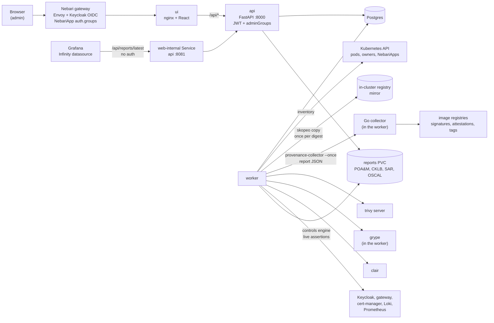

Everything runs in the release namespace. One Helm release deploys:

| Component | Kind | Role |
|---|---|---|
| **ui** | Deployment (nginx) | Serves the nebari-design React UI and proxies `/api/*` to the api. The NebariApp routes the gateway here. |
| **api** | Deployment (FastAPI, `:8000`) | `/api/v1` JSON API, report generation, settings; verifies the Keycloak JWT and `adminGroups` on every request. Serves the provenance-collector compatible routes (`/api/reports*`, `/api/export`, `/api/me`, `/api/scan`, `/healthz`). With `provenance.compat.internalService.enabled` a second, unauthenticated listener (`:8081`) serves only the read-only report routes for Grafana. |
| **worker** | Deployment | Scheduler and scan pipeline (below). Bundles trivy (client), grype, clairctl, cosign, skopeo and the Go **provenance-collector** binary. |
| **postgres** | StatefulSet | Scans, inventory, findings, provenance, control assertion runs, report metadata; also Clair's database. Optional (`postgresql.enabled=false` + `externalDatabase.*`). |
| **trivy** | Deployment | Trivy server; holds the Trivy vulnerability DB. |
| **clair** | Deployment | Clair 4 in combo mode (indexer + matcher + updaters). |
| **web-internal** | Service | ClusterIP in front of the api's compat listener, reachable only from `allowedNamespaces` (NetworkPolicy). Never routed by the gateway. |

## A scan

1. **Inventory.** Every pod in every namespace except `scanner.excludedNamespaces`,
   resolved to its controller (Deployment, StatefulSet, CronJob, ...) and to a
   NebariApp / pack, deduplicated to unique images by digest.
2. **Provenance** (concurrently with scanning). The worker runs
   `provenance-collector --once --output <file>` with its own ServiceAccount and
   ingests the report: signatures, SBOM and SLSA attestations, updates, Helm
   releases. Images the collector could not resolve, and every image if the binary
   fails, go through the worker's Python checks. See
   [Supply-chain provenance](/provenance/#engines).
3. **Mirror and scan.** Each new digest is copied once into the in-cluster
   registry (`scanner.mirror`) so Trivy, Grype and Clair see identical bytes;
   the three results are correlated into consensus findings per CVE and package.
4. **Posture checks.** 16 checks on one representative pod per workload, mapped
   to the Kubernetes STIG / Container Platform SRG.
5. **Scoring.** Image, workload, namespace and cluster scores and grades
   ([Scoring](/scoring/)).
6. **Reports and controls.** `reports.autoGenerate` report types are generated,
   then the control evidence engine runs its assertions and derives control
   statuses ([Controls](/controls/)).

The provenance report served at `/api/reports/latest` is built from the latest
completed scan, in the provenance-collector schema ([Report Schema](/report-schema/)).

For the compliance view (evidence layers, control inheritance, the cATO loop)
see [Compliance architecture](/compliance-architecture/). The full component
contract is [Design](/design/).

## Security model

- The UI and every API route are **admin-only**: the NebariApp asks the operator
  to enforce `auth.groups` at the gateway (or the chart renders its own Envoy
  `SecurityPolicy`, `adminGate.securityPolicy.enabled`), and the api verifies the
  JWT signature, issuer and group membership itself.
- The api and worker ServiceAccount is read-only cluster-wide (pods, workloads,
  namespaces, nodes, NetworkPolicies, ServiceAccounts, NebariApps). Secrets are
  readable only with `provenance.helmReleases.enabled` (Helm release Secrets) and
  for exactly one Keycloak admin Secret when the controls engine is on.
- All containers run as non-root with a read-only root filesystem (except
  nginx), all capabilities dropped and the RuntimeDefault seccomp profile.
